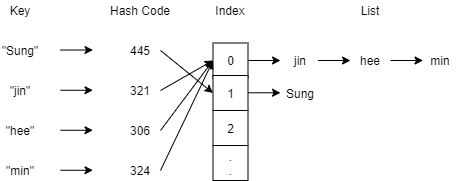

# [HashTable] Hash Table 개념, 구현

해시 테이블(Hash Table)에 대해 알아볼겠습니다.


## 해시 테이블(Hash Table)이란?

>  검색하고자 하는 키 값을 입력받은 해시 코드를 배열의 인덱스로 환산을해서 데이터에 접근하는 자료구조


* F(key) => Hash Code => Index => Value

* key값은 문자, 숫자, 파일 등이 될 수 있다.

* 입력받은 key의 사이즈와 상관없이 동일한 사이즈의 Hash Code를 반환한다.

* 블록체인에서도 이 기술이 적용된다.

  * 10분 간격으로 성사된 기록을 블록체인 창고에 저장

  * 지금까지 일어난 모든 기록을 모든 사용자들의 전자 지갑에 갖고있게한다.
  * 모든 기록들을 가지고 서로 비교하면 시간이 너무 오래걸린다.
  * 따라서, 저장된 해시 코드들끼리 비교한다.
  * 코드 한자리만 다르더라도 다른 값을 반환하기 때문에 조작이 어렵다.


## 해시 테이블의 장점, 단점

### 장점

* 검색 속도가 빠르다.
  1. 해시 함수로 만든 해시 코드는 정수다.
  2. 배열을 고정된 크기만큼 미리 생성한다.
  3. 해시 코드를 배열의 크기로 나머지 연산을 통해 나온 값으로 배열에 나눠 담는다.

* 해시 코드가 배열의 인덱스로 사용되기 때문에 검색할 필요가 없다.


### 단점

* 알고리즘을 잘못 만들면 배열의 한곳에 몰릴수도 있다.
* Hash Algorithm Collison
  * 시간복잡도가 O(1)에서 O(n)까지도 걸릴 수 있다.
  * 따라서, 잘 분배하는법이 중요하다.
  * Different Keys => Same Code
    * 서로 다른 키값으로 동일한 중복된 코드 생성
    * 해시 코드는 정수값이기 때문에 발생
  * Different Code => Same Index
    * 다른 코드로 같은 인덱스 배정


## 예제를 통한 설명

### 데이터 삽입

getHashCode(key) 함수 생성

'k'의 ASCII 값 + 'e'의 ASCII 값 + 'e'의 ASCII 값 = HashCode

*※ 위 규칙은 임의로 정한것임*

---

getHashCode(sung)

s(115) + u(117) + n(110) + g(103) = 445

j(106) + i(105) + n(110) = 321

h(104) + e(101) + e(101) = 306

m(109) + i(105) + n(110) = 324

---

Convert To Index(HashCode)

Array[size = 3]

HashCode % size => Index

445 % 3 = 1

321 % 3 = 0

306 % 3 = 0

324 % 3 = 0

배열 안에 Linked List를 선언하고 데이터가 배열방에 할당될 때마다 추가


### 데이터 검색

1. 'jin' 을 getHashCode로 해시 코드로 변환
2. 1에서 만든 해시 코드를 배열의 사이즈인 3으로 나머지 연산
3. 2의 결과로 0이 나왔기 때문에 인덱스가 0인 곳의 리스트에서 'jin' 을 검색





## Hash Table 구현 코드 in Java

```java
import java.util.LinkedList;

class HashTable {
	class Node {
		String key;
		String value;
		public Node(String key, String value) {
			this.key = key;
			this.value = value;
		}
		String value() {
			return value;
		}
		void value(String value) {
			this.value = value;
		}
	}
	
	LinkedList<Node>[] data;
	HashTable(int size) {
		this.data = new LinkedList[size];
	}
	int getHashCode(String key) {
		int hashcode = 0;
		for(char c : key.toCharArray()) {
			hashcode += c;
		}
		return hashcode;
	}
	int convertToIndex(int hashcode) {
		return hashcode % data.length;
	}
	Node searchKey(LinkedList<Node> list, String key) {
		if(list == null) return null;
		for(Node node : list) {
			if(node.key.equals(key)) {
				return node;
			}
		}
		return null;
	}
	void put(String key, String value) {
		int hashcode = getHashCode(key);
		int index = convertToIndex(hashcode);
		System.out.println(key + ", hashcode(" + hashcode + "), index(" + index + ")");
		LinkedList<Node> list = data[index];
		if(list == null) {
			list = new LinkedList<Node>();
			data[index] = list;
		}
		Node node = searchKey(list, key);
		if(node == null) {
			list.addLast(new Node(key, value));
		}else {
			node.value(value);
		}
	}
	String get(String key) {
		int hashcode = getHashCode(key);
		int index = convertToIndex(hashcode);
		LinkedList<Node> list = data[index];
		Node node = searchKey(list, key);
		return node == null? "Not found" : node.value();
	}
}

public class HashTableTest {
	public static void main(String[] args) {
		HashTable h = new HashTable(3);
		h.put("sung", "She is pretty");
		h.put("jin", "She is a model");
		h.put("hee", "She is an angel");
		h.put("min", "She is cute");
		h.put("sung", "She is beautiful");
		System.out.println(h.get("sung"));
		System.out.println(h.get("jin"));
		System.out.println(h.get("hee"));
		System.out.println(h.get("min"));
		System.out.println(h.get("jae"));
	}
}
```


## 링크

아래 강의를 참고하여 작성하였습니다.

* [엔지니어대한민국 - 해쉬테이블(Hash Table)에 대해 알아보고 구현하기](https://www.youtube.com/watch?v=Vi0hauJemxA&list=PLjSkJdbr_gFaPf3ojJFZYXXA__8zcUpdZ)


