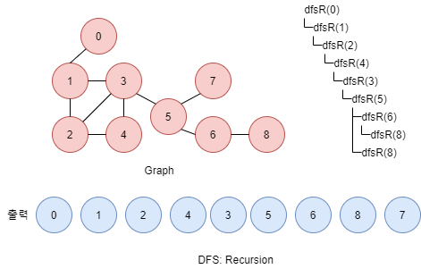

# [Graph] Graph 개념, 표현 방법

그래프(Graph)에 대해 알아볼겠습니다.

## 그래프(Graph)란?

### 강의 영상에서의 설명

> 트리는 노드가 있고 노드를 연결하는 엣지가 있다.
>
> 엣지의 방향은 위에서 아래로 간다.
>
> 만약, 엣지의 방향이 위아래로 있고 방향을 안 갖고 있을수 있고 ...
>
> 자기 자신을 가리키기도 하면... !@#$%
>
> 그것이 그래프입니다.

### 위키백과 설명

그래프는 vertex와 edge로 구성된 한정된 자료구조를 의미한다.

vertex는 정점, edge는 정점과 정점을 연결하는 간선이다.

* [위키백과 - 그래프](https://ko.wikipedia.org/wiki/%EA%B7%B8%EB%9E%98%ED%94%84_(%EC%9E%90%EB%A3%8C_%EA%B5%AC%EC%A1%B0))

### 나의 설명

간선을 통해 연결된 정점들이 모인 자료구조...

**그냥 그림을 보고 이해하자!**

> 참조 - 트리도 그래프의 한 종류이다.
>
> 모든 트리는 방향이 아래로 가기 때문에 화살표를 생략 가능.

## Directed VS Undirected

* Directed - edge의 방향을 있다.

* Undirected - edge가 방향이 없다.

## Cyclic VS Acyclic

* Cyclic - 사이클이 하나 이상 존재
* Acyclic - 사이클이 없음

## 그래프를 표현하는 방법

* 인접 행렬 (Adjacency Matrix) - 2차원 배열에 표현
* 인접 리스트 (Adjacency List) - 배열에 노드들을 나열하고 관계를 Linked Lsit로 표현

### Adjacency Matrix

* 각각의 노드들의 번호로 구성된 노드들을 테이블로 구성
* 서로 연결되면 1, 연결되지 않았으면 0으로 채운다.

아래 그래프를 Adjacency Matrix로 표현해보자.

### Adjacency List

* 배열에 모든 노드를 넣는다.
* 배열에 들어간 각 노드에 인접한 노드들을 Linked List로 채워준다.
* Linked List를 채울때 순서는 상관없다.
* List의 총 노드의 개수는 엣지의 개수x2
  * 서로 연결된걸 모두 적어주기 때문에

아래 그래프를 Adjacency List로 표현해보자.

엣지의 개수 m(위 예제에서는 4)

리스트 안의 원소의 개수 2m(위 예제에서는 2, 3, 4, 1, 1, 4, 1, 3 이므로 8)

## Graph Search 종류

그래프를 탐색하는 방법

* 깊이 우선 탐색(Depth First Search)
* 너비 우선 탐색(Breadth First Search)

### Depth First Search(DFS)

Binary Tree를 검색할때 사용했던 아래 3개가 DFS에 속한다.

* Inorder
* Preorder
* Postorder

1. 자식의 자식의 자식...을 계속해서 방문
2. 잎 노드를 만나면 다시 올라온다.

### Breadth First Search(BFS)

순서대로 레벨별로 자식들을 탐색

## DFS, BSF 순서 비교

탐색하는 과정을 순서대로 비교해보며 이해해보겠습니다.

## DFS, BSF 과정

과정은 이용하는 자료구조만 바뀌고 동일하다.

### DFS: Stack을 이용

1. 빈 스택을 만든다.
2. 시작할 노드를 스택에 넣어준다.
3. 아래를 반복
   1. 스택에서 노드 하나를 꺼낸다.
   2. 꺼낸 노드의 인접한 노드를 전부 스택에 넣는다.
      * 꺼냈던 노드는 다시 스택에 넣지 않음
      * 인접한 노드가 없다면 다음으로 진행
   3. 꺼낸 노드는 출력한다.
4. 모든 노드를 탐색했다면 종료.

### BFS: Queue를 이용

1. 빈 큐를 만든다.
2. 시작할 노드를 큐에 넣어준다.
3. 아래를 반복
   1. 큐에서 노드 하나를 꺼낸다.
   2. 꺼낸 노드의 인접한 노드를 전부 큐에 넣는다.
      * 꺼냈던 노드는 다시 큐에 넣지 않음
      * 인접한 노드가 없다면 다음으로 진행
   3. 꺼낸 노드는 출력한다.
4. 모든 노드를 탐색했다면 종료.

### 시작점은 항상 0?

위 그래프의 0에서 시작한 DFS, BFS 결과값이다.

* DFS(0) = 0 1 3 5 7 6 8 4 2
* BFS(0) = 0 1 2 3 4 5 6 7 8

그래프는 트리만 있는게 아니기 때문에 시작은 0에서 할 필요는 없다.

예를 들어 3에서 시작해도 순회는 잘 된다.

* DFS(3) = 3 5 7 6 8 4 2 1 0
* BFS(3) = 3 1 2 4 5 0 6 7 8

### DFS: Recursion

DFS는 재귀를 통해 보다 쉽게 구현할 수 있다.

* 방문하면 자신을 출력하고 인접한 노드를 넣어 재귀호출 한다.

* 재귀는 정방향이기 때문에 자신이 먼저 출력된다.
* 먼저 입력된 연결 관계에 따라 결과가 달라진다.

## 링크

아래 강의를 참고하여 작성하였습니다.

* [엔지니어대한민국 - 그래프(Graph)에 대해서](https://www.youtube.com/watch?v=fVcKN42YXXI&list=PLjSkJdbr_gFY8VgactUs6_Jc9Ke8cPzZP&index=5)
* [엔지니어대한민국 - Graph 검색 DFS, BFS 구현 in Java](https://www.youtube.com/watch?v=_hxFgg7TLZQ&list=PLjSkJdbr_gFY8VgactUs6_Jc9Ke8cPzZP&index=6)

