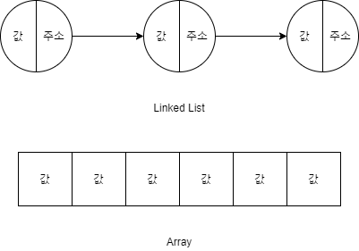
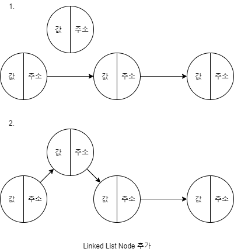
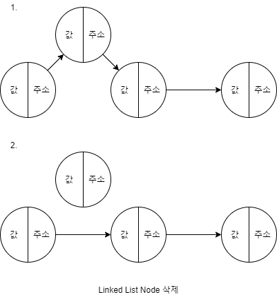
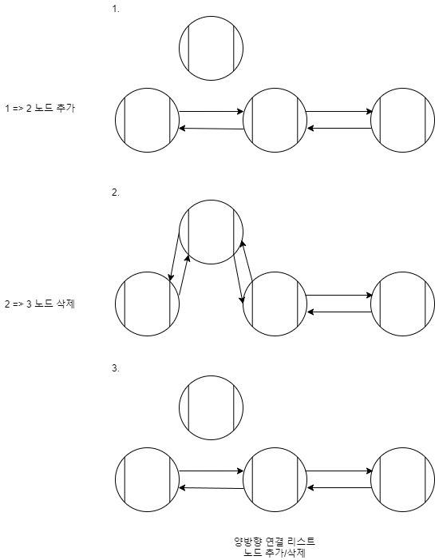

# [LinkedList] Linked List 개념

연결 리스트(Linked List)에 대해 알아볼겠습니다.

## Linked List 개념

>  자료구조의 하나로 현재 노드에 자신의 값과 다음 노드의 주소값을 가지고 있는다.

* 한번 선언한 배열은 사이즈를 변경할 수 없다. 반대로 링크드 리스트는 변경이 가능함.
* 두 노드 사이에 다른 노드를 삽입할 수 있다.
* 주소를 하나씩 찾아가야 하므로 배열보다는 속도가 느릴수 있다.

※ 위 그림의 주소는 다음 노드의 주소를 가리킨다.

>  길이가 정해지지 않은 데이터를 사용할때는 링크드리스트로 구현하자.

## Linked List 노드 추가/삭제

### Linked List 노드 추가

1. 삽입하고자 하는 두 노드의 연결을 끊는다.
2. 이전 노드의 다음 주소를 새 노드로 연결한다.
3. 새 노드의 주소를 다음 노드로 연결한다.

### Linked List 노드 삭제

1. 삭제하고자 하는 노드의 연결을 끊는다.
2. 이전 노드의 주소를 다음 노드로 연결한다.

## 단방향/양방향 연결 리스트란?

### 단방향 연결 리스트(Singly Linked List)

* 다음 노드의 주소만 가지고 있다.
* 양방향 연결 리스트에 비해 메모리 공간을 절약할 수 있다.

### 양방향 연결 리스트(Doubly Linked List)

* 이전 노드와 다음 노드의 주소를 가지고 있다.
* 리스트의 앞, 뒤에서 모두 접근 가능하다.
* 메모리 공간이 더 필요하게 된다.

## 양방향 연결 리스트 노드 추가 및 삭제

## 링크

아래 강의를 참고하여 작성하였습니다.

* [엔지니어대한민국 - Linked List 개념](https://www.youtube.com/watch?v=DzGnME1jIwY&list=PLjSkJdbr_gFZQp0KEoo0Y4KkCI5YqxtjZ)
* [엔지니어대한민국 - 단방향 Linked List 구현 in Java](https://www.youtube.com/watch?v=C1SDkdPvQPA&list=PLjSkJdbr_gFZQp0KEoo0Y4KkCI5YqxtjZ&index=3)
* [엔지니어대한민국 - LinkedListNode의 구현 in Java](https://www.youtube.com/watch?v=IrXYr7T8u_s&list=PLjSkJdbr_gFZQp0KEoo0Y4KkCI5YqxtjZ&index=4)
* [엔지니어대한민국 - 단방향/양방향 Linked List 개념](https://www.youtube.com/watch?v=G4IIDyfoHeY&list=PLjSkJdbr_gFZQp0KEoo0Y4KkCI5YqxtjZ&index=2)

