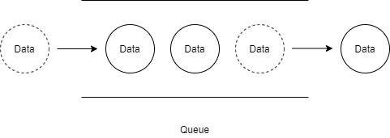

# [Queue] Queue 개념, 구현

큐(Queue)에 대해 알아볼겠습니다.


## 큐(Queue)란?

* 먼저 저장한 데이터를 가장 먼저 꺼낼 수 있는 자료구조
* FIFO(First In First Out)





## Queue의 주요 메소드

* add - 새로운 데이터를 맨 끝에 넣음
* remove - 맨 앞 데이터를 가져오면서 삭제
* peek - 맨 앞 데이터를 가져옴
* isEmpty - 큐에 데이터가 있는지 확인


## Queue 구현 코드 in Java

```java
import java.util.NoSuchElementException;

class Queue<T> {
	
	class Node<T>{
		private T data;
		private Node<T> next;
		
		public Node(T data) {
			this.data = data;
		}
	}
	
	private Node<T> first;
	private Node<T> last;
	
	public void add(T item) {
		Node<T> t = new Node<T>(item);
		
		if(last != null) {
			last.next = t;
		}
		last = t;
		if(first == null) {
			first = last;
		}
	}
	
	public T remove() {
		if(first == null) {
			throw new NoSuchElementException();
		}
		
		T data = first.data;
		first = first.next;
		
		if(first == null) {
			last = null;
		}
		return data;
	}
	
	public T peek() {
		if(first == null) {
			throw new NoSuchElementException();
		}
		return first.data;
	}
	
	public boolean isEmpty() {
		return first == null;
	}
}

public class Test {
	public static void main(String[] args) {
		Queue<Integer> q = new Queue<Integer>();
		q.add(1);
		q.add(2);
		q.add(3);
		q.add(4);
		System.out.println(q.remove());
		System.out.println(q.remove());
		System.out.println(q.peek());
		System.out.println(q.remove());
		System.out.println(q.isEmpty());
		System.out.println(q.remove());
		System.out.println(q.isEmpty());
	}
}
```


## 링크

아래 강의를 참고하여 작성하였습니다.

* [엔지니어대한민국 - Queue구현하기 in Java](https://www.youtube.com/watch?v=W3jNbNGyjMs&list=PLjSkJdbr_gFZL2BNnGLvTgMYXptKGIyum&index=2)


