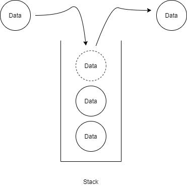

# [Stack] Stack 개념, 구현

스택(Stack)에 대해 알아볼겠습니다.


## 스택(Stack)이란?

* 나중에 저장한 데이터를 가장 먼저 꺼낼 수 있는 자료구조
* LIFO(Last In First Out)





## Stack의 주요 메소드

* push - 새로운 데이터를 맨 위에 쌓아 올림
* pop - 맨 마지막에 넣은 데이터를 가져오면서 삭제
* peek - 마지막 데이터를 가져옴
* isEmpty - 스택에 데이터가 있는지 확인


## Stack 구현 코드 in Java

```java
import java.util.EmptyStackException;

class Stack<T> {
	class Node<T>{
		private T data;
		private Node<T> next;
		
		public Node(T data) {
			this.data = data;
		}
	}
	
	private Node<T> top;
	
	public T pop() {
		if(top == null) {
			throw new EmptyStackException();
		}
		
		T item = top.data;
		top = top.next;
		return item;
	}
	
	public void push(T item) {
		Node<T> t = new Node<T>(item);
		t.next = top;
		top = t;
	}
	
	public T peek() {
		if(top == null) {
			throw new EmptyStackException();
		}		
		return top.data;
	}
	
	public boolean isEmpty() {
		return top == null;
	}
}

public class Test {
	public static void main(String[] args) {
		Stack<Integer> s = new Stack<Integer>();
		s.push(1);
		s.push(2);
		s.push(3);
		s.push(4);
		System.out.println(s.pop());
		System.out.println(s.pop());
		System.out.println(s.peek());
		System.out.println(s.pop());
		System.out.println(s.isEmpty());
		System.out.println(s.pop());
		System.out.println(s.isEmpty());	
	}
}
```


## 링크

아래 강의를 참고하여 작성하였습니다.

* [엔지니어대한민국 - Stack 구현하기 in Java](https://www.youtube.com/watch?v=whVUYv0Leg0&list=PLjSkJdbr_gFZL2BNnGLvTgMYXptKGIyum)

