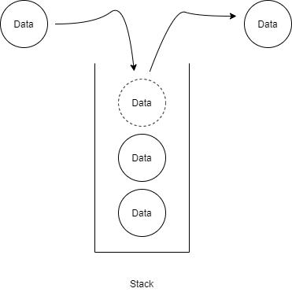

# [Stack] Stack 개념, 구현

스택(Stack)에 대해 알아볼겠습니다.

## 스택(Stack)이란?

* 나중에 저장한 데이터를 가장 먼저 꺼낼 수 있는 자료구조
* LIFO(Last In First Out)

## Stack의 주요 메소드

* push - 새로운 데이터를 맨 위에 쌓아 올림
* pop - 맨 마지막에 넣은 데이터를 가져오면서 삭제
* peek - 마지막 데이터를 가져옴
* isEmpty - 스택에 데이터가 있는지 확인

## 링크

아래 강의를 참고하여 작성하였습니다.

* [엔지니어대한민국 - Stack 구현하기 in Java](https://www.youtube.com/watch?v=whVUYv0Leg0&list=PLjSkJdbr_gFZL2BNnGLvTgMYXptKGIyum)

