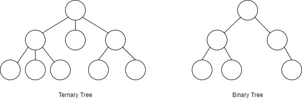

# [Tree] Tree의 개념, 종류

트리(Tree)에 대해 알아볼겠습니다.

## 트리(Tree)란?

* 부모 자식관계를 가지는 자료 구조
* 계층, 그룹이 있다.
* 부모 노드(Parent Node)는 하나 이상의 자식(Child Node)을 갖고 있다.(Leaf Node 제외)
* 부모가 없는 맨 위의 노드 루트 노드(Root Node)라 부른다
* 트리의 맨 끝에 자식이 없는 노드를 잎 노드(Leaf Node)라 부른다.
* 루트 노드부터 잎 노드까지 Level이 0, 1, 2 ... 하나씩 증가한다.

## 이진 트리(Binary Tree)

* 자식 노드가 최대 2개까지면 이진트리(Binary Tree)
* 자식 노드가 최대 3개까지면 Ternary Tree

## 이진 탐색 트리(Binary Search Tree)

* 왼쪽 자식 노드들과 그 이하 노드들은 자신보다 작아야하고 오른쪽 노드들과 그 이하 노드들은 자신보다 커야한다.
* 왼쪽 자식들 < 자신 < 오른쪽 자식들
* 값을 찾을때 용의함

## 균형(Balance)

* 한쪽으로 치우치면 unbalanced
* balanced는 양쪽의 노드가 정확하게 일치할 필요없다
* balanced Tree의 종류
  * red-black tree
  * AVL tree

## 완전 이진 트리(Complete Binary Tree)

* 노드들이 레벨별로 왼쪽부터 채워져 있는 트리

## 정 이진 트리(Full Binary Tree)

* 한개의 자식 노드를 가진 노드가 하나도 없는 트리
* 모든 노드가 자식이 0개 또는 2개

## 포화 이진 트리(Perfect Binary Tree)

* 모든 노드가 2개의 자식 노드를 가진다.
* 모든 노드의 개수가 2^n -1

---

## Binary Tree Traversal

>  이진 트리를 횡단하면서 트리의 모든 데이터를 가져오는 방법

* Inorder
  * Left - Root - Right
* Preorder
  * Root - Left - Right
* Postorder
  * Left - Right - Root

## Exemple

예제를 통한 순서 알아보기

### Inorder

* 4 - 2 - 5 - 1 - 3

### Preorder

* 1 - 2 - 4 - 5 - 3

### Postorder

* 4 - 5 - 2 - 3 - 1

---

## 힙(Heap) 이란?

>    최대값이나 최솟값을 빠르게 찾기 위해 고안된 완전 이진 트리를 기본으로한 자료구조

### 최소힙(Min Heap)

* 항상 부모 노드에 작은 값을 위치

* 루트에는 가장 작은 값이 위치

### 최대힙(Max Heap)

* 항상 부모 노드에 큰 값을 위치

* 루트에는 가장 작은 값이 위치

## 최소힙에 노드 삽입하기

1. 새로운 노드를 마지막 레벨의 왼쪽부터 채운다.
2. 자신(새로운 노드)과 부모랑 비교하여 자신이 작으면 부모랑 자리를 바꾼다.
3. 루트에 도달하거나 부모가 자신 보다 클때까지 2번을 반복한다.

* 시간 복잡도는 O(logN)

## 최소힙에서 노드 꺼내오기

1. 루트에서 최소값을 꺼낸다.
2. 맨마지막 노드의 값을 루트에 채운다.
3. 자신과 자식 노드들과 값을 비교하여 자기보다 더 작은 값이랑 위치를 바꾼다.
4. 잎 노드에 도착하거나 자식이 모두 자기보다 클때까지 3번을 반복한다.

---

## 트라이 트리(Trie Tree) 란?

> 특히 문자열에서 빠르게 검색을 해주는 트리 구조

### Binary Tree의 경우

* 노드의 배열에서 검색을 하기 O(long n) 시간복잡도를 갖아 비효율적이다.

### Trie Tree의 경우

* 사전을 만든다고 가정

* 단어의 한글자씩 노드에 저장시켜 다음 글자를 Child Node에서 찾는다.

* 트리에 문자열이 세로로 저장되어 있다.
* Root Node는 비운다

* 시간 복잡도는 O(M)

## 링크

아래 강의를 참고하여 작성하였습니다.

* [엔지니어대한민국 - Tree의 종류](https://www.youtube.com/watch?v=LnxEBW29DOw&list=PLjSkJdbr_gFY8VgactUs6_Jc9Ke8cPzZP)
* [엔지니어대한민국 - Binary Tree의 3가지 순회방법 구현하기](https://www.youtube.com/watch?v=QN1rZYX6QaA&list=PLjSkJdbr_gFY8VgactUs6_Jc9Ke8cPzZP&index=2)
* [엔지니어대한민국 - Binary Heaps (Min-Heaps and Max-Heaps)](https://www.youtube.com/watch?v=jfwjyJvbbBI&list=PLjSkJdbr_gFY8VgactUs6_Jc9Ke8cPzZP&index=3) 
* [엔지니어대한민국 - Trie(트라이) Tree에 대해서](https://www.youtube.com/watch?v=TohdsR58i3Q&list=PLjSkJdbr_gFY8VgactUs6_Jc9Ke8cPzZP&index=4)

